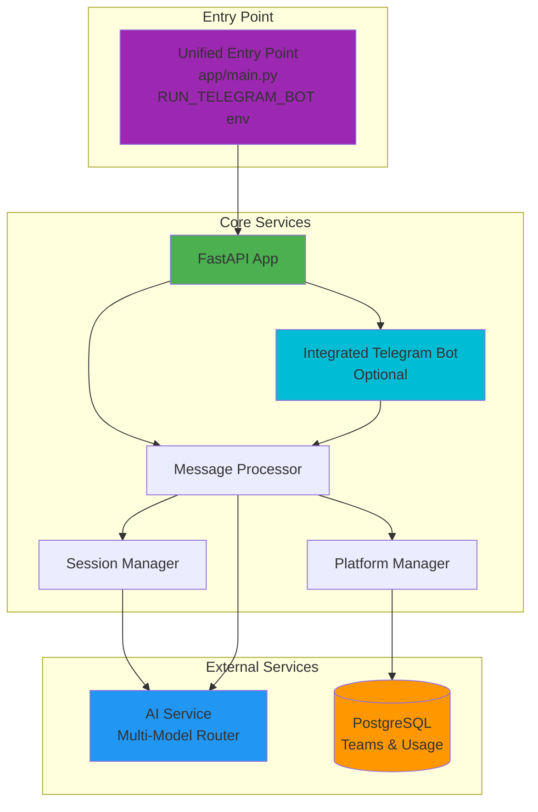
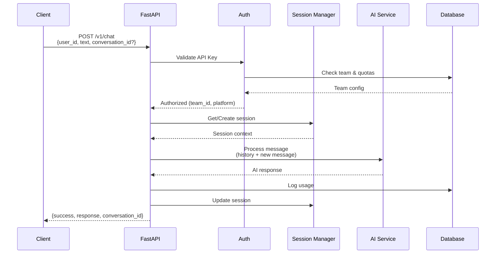

# Arash External API

**Multi-platform AI chatbot service with team-based access control, supporting Telegram and REST API integrations.**

Powered by multiple AI models (GPT, Claude, Gemini, Grok, DeepSeek) with intelligent session management, rate limiting, and usage tracking.

---

## Architecture



## API Flow



---

## Quick Start

```bash
# 1. Install dependencies
uv sync --all-extras

# 2. Configure environment
cp .env.example .env  # Edit: DB, AI_SERVICE_URL, tokens

# 3. Setup database (choose one option)

# Option A: Fresh database (recommended for first-time setup)
# Drop existing database and recreate with new schema
# WARNING: This will DELETE ALL DATA
psql -U postgres -c "DROP DATABASE IF EXISTS arash_db;"
psql -U postgres -c "CREATE DATABASE arash_db OWNER arash_user;"

# Option B: Reset existing database (if already exists)
# This removes the alembic_version table to allow clean migration
psql -d arash_db -U arash_user -c "DROP TABLE IF EXISTS alembic_version CASCADE;"

# 4. Apply database migrations
make migrate-up

# 5. Run service (API + integrated Telegram bot)
make run-dev
# IMPORTANT: THE DOCS IS DISABLED IN `make run` like the prod and stage.

```

---

## Database Migrations

This project uses Alembic for database schema management. All migrations have been squashed into a single initial migration for clean deployment.

### Migration Structure

- **Single Initial Migration**: `alembic/versions/001_initial_schema.py`
  - Creates all tables: `channels`, `api_keys`, `usage_logs`, `messages`
  - Includes all indexes and foreign key constraints

### Available Commands

```bash
# Apply all pending migrations
make migrate-up

# Rollback last migration
make migrate-down

# Check current migration status
make migrate-status

# Create new migration after model changes
make migrate-create MSG="Description of changes"
```

### Resetting Database

If you need to reset your database (development only):

```bash
# Method 1: Drop and recreate database
psql -U postgres -c "DROP DATABASE IF EXISTS arash_db;"
psql -U postgres -c "CREATE DATABASE arash_db OWNER arash_user;"
make migrate-up

# Method 2: Just reset migrations (keeps other data)
psql -d arash_db -U arash_user -c "DROP TABLE IF EXISTS alembic_version CASCADE;"
make migrate-up
```

### Migration History

All previous migrations have been backed up in `alembic/versions_backup/` and squashed into the single initial migration. This ensures:
- ✅ Clean deployment for new environments
- ✅ No migration conflicts
- ✅ Simplified migration history
- ✅ Faster database initialization

---

## Configuration

Essential environment variables (`.env`):

```bash
# Database
DB_HOST=localhost
DB_PORT=5432
DB_USER=arash
DB_PASSWORD=***
DB_NAME=arash_db

# AI Service (external multi-model router)
AI_SERVICE_URL=https://our-ai-service.com

# Authentication
SUPER_ADMIN_API_KEYS=admin_key_1,admin_key_2  # Comma-separated
TELEGRAM_BOT_TOKEN=***
TELEGRAM_SERVICE_KEY=***  # For Telegram platform auth

# Runtime
RUN_TELEGRAM_BOT=true  # Run bot integrated with API service
ENVIRONMENT=production
LOG_LEVEL=INFO
```

---

## Key Architecture Behaviors

### Message Counting

The `total_message_count` field returned in API responses tracks the total number of **conversation messages** (user messages + AI responses) stored in the database.

**Important Notes:**

- ✅ **Counted:** User chat messages and AI assistant responses
- ❌ **NOT Counted:** Commands (e.g., `/model`, `/help`, `/clear`, `/status`)
- **Persistence:** `total_message_count` persists through `/clear` command
- **Purpose:** Used for analytics and tracking conversation depth

**Example:**

```json
{
  "success": true,
  "response": "مدل شما به GPT-4 تغییر کرد.",
  "model": "GPT-4",
  "total_message_count": 10  // Only counts actual messages, not this /model command
}
```

---

**Version:** 1.0.0 | **API Docs:** [Apidog](https://app.apidog.com/project/1110139) | **Development:** See [CLAUDE.md](CLAUDE.md)
