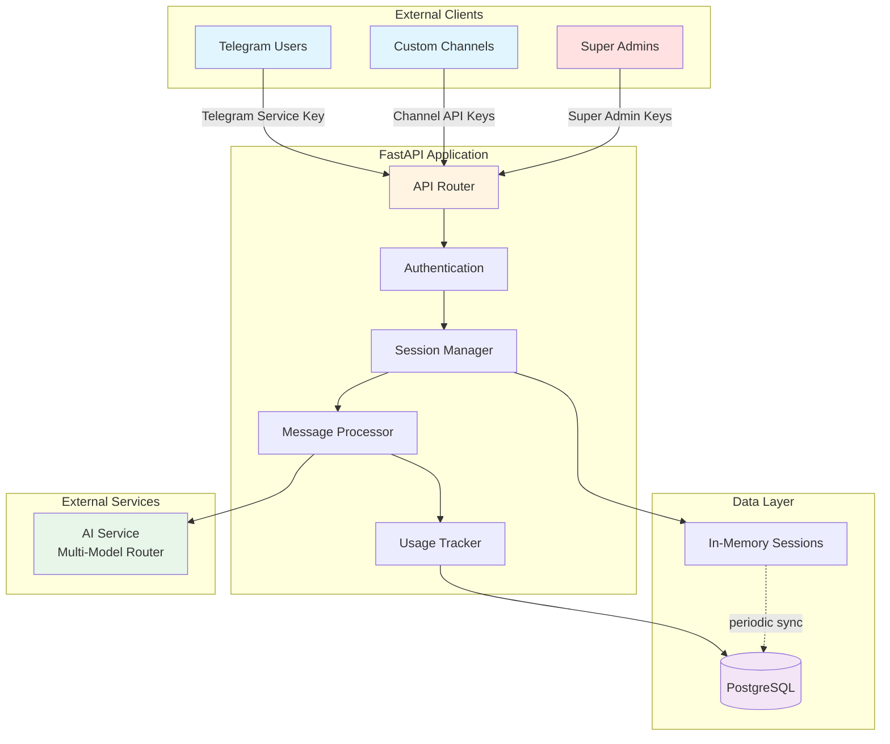
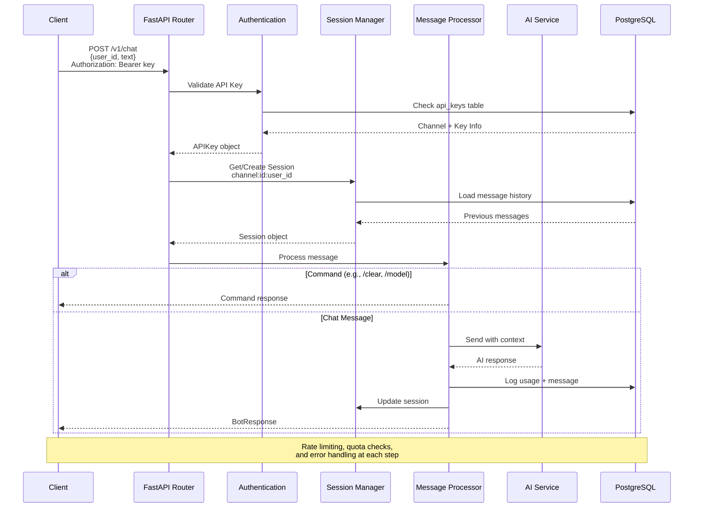

# Arash External API

Multi-platform AI chatbot service with channel-based access control.

**Stack:** FastAPI + PostgreSQL + Telegram Bot | **Models:** GPT, Claude, Gemini, Grok, DeepSeek

---

## System Overview

### Architecture Diagram



### Request Flow



---

## Architecture

```
app/main.py (Entry Point)
│
├── FastAPI Application
│   ├── /v1/chat (Public - All API keys)
│   ├── /v1/commands (Public)
│   └── /v1/admin/* (Super admin only)
│
├── Telegram Bot (Optional - RUN_TELEGRAM_BOT=true)
│
└── Core Services
    ├── ChannelManager (channel_identifier → config)
    ├── SessionManager (In-memory sessions)
    ├── MessageProcessor (Commands + AI routing)
    └── UsageTracker (PostgreSQL logging)

External: AI Service (Multi-model router), PostgreSQL
```

**Database Tables:**
- `channels` - Integration endpoints (Telegram, customer channels)
- `api_keys` - Authentication keys per channel
- `usage_logs` - Request tracking
- `messages` - Conversation history

---

## Quick Start

```bash
# 1. Install
uv sync --all-extras

# 2. Configure
cp .env.example .env
# Edit: DB_*, AI_SERVICE_URL, TELEGRAM_BOT_TOKEN, INTERNAL_API_KEY, SUPER_ADMIN_API_KEYS

# 3. Database setup
psql -U postgres -c "DROP DATABASE IF EXISTS arash_db;"
psql -U postgres -c "CREATE DATABASE arash_db OWNER arash_user;"
make migrate-up

# 4. Run
make run-dev  # API at :3000, docs at :3000/docs (dev only)
```

---

## API Endpoints

**Public** (All API keys):
- `POST /v1/chat` - Send message, get AI response
- `GET /v1/commands` - List available commands

**Admin** (Super admin keys only):
- `GET /v1/admin/channels` - List all channels
- `POST /v1/admin/channels` - Create channel
- `GET /v1/admin/stats` - Usage statistics
- `GET /v1/admin/sessions` - Active sessions

---

## Configuration

Essential `.env` variables:

```bash
# Database (PostgreSQL only)
DB_HOST=localhost
DB_PORT=5432
DB_USER=arash_user
DB_PASSWORD=***
DB_NAME=arash_db

# AI Service
AI_SERVICE_URL=https://your-ai-service.com

# Authentication (all required)
TELEGRAM_BOT_TOKEN=***                    # Telegram bot token
TELEGRAM_SERVICE_KEY=***                  # For bot API auth (min 32 chars)
INTERNAL_API_KEY=***                      # Private channels (min 32 chars)
INTERNAL_MODELS=["openai/gpt-5-chat","google/gemini-2.0-flash-001"]
SUPER_ADMIN_API_KEYS=key1,key2            # Comma-separated admin keys

# Runtime
RUN_TELEGRAM_BOT=true                     # Enable Telegram bot
ENVIRONMENT=production
LOG_LEVEL=INFO
ENABLE_API_DOCS=false                     # true in dev only
```

---

## Commands

**Development:**
```bash
make install        # Install dependencies (uv)
make run            # Start service
make run-dev        # Start with auto-reload
make test           # Run tests (345 tests)
make lint           # Code quality check
make format         # Format code
make clean          # Remove cache
```

**Database:**
```bash
make migrate-up                      # Apply migrations
make migrate-down                    # Rollback
make migrate-status                  # Show status
make migrate-create MSG="desc"       # Create migration
```

**Channel Management:**
```bash
make db-channels                           # List channels
make db-keys                               # List API keys
make db-channel-create NAME="Ch" DAILY=100 MONTHLY=3000
make db-key-create CHANNEL=<id> NAME="Key"
```

---

## Key Behaviors

**Message Counting:**
- `total_message_count` tracks chat messages only (user + assistant)
- Commands (`/model`, `/help`, `/clear`) are NOT counted
- Persists through `/clear` command

**Session Management:**
- One conversation per user per channel
- Session ID: `channel_identifier:channel_id:user_id`
- Messages persist in DB; `/clear` removes from AI context only

**Channel Types:**
- **Public** (telegram): Public messaging, basic rate limiting
- **Private** (customer channels): Authenticated, custom quotas, full isolation

---

**Version:** 1.0.0 | **Package Manager:** uv | **Python:** 3.11+ | **Database:** PostgreSQL
