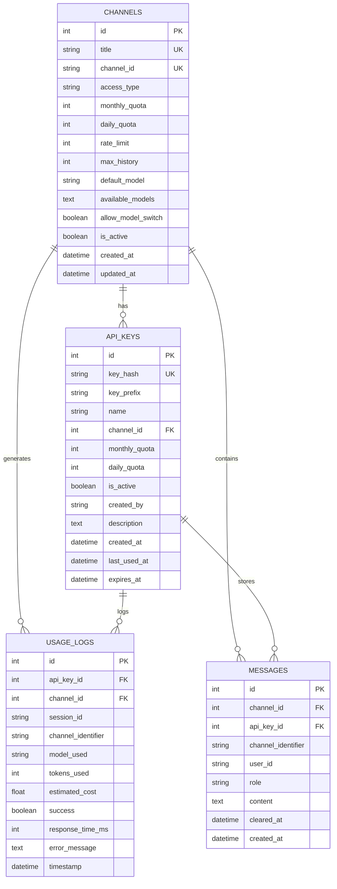

# ER - Diagram

```mermaid
erDiagram
    CHANNELS ||--o{ API_KEYS : has
    CHANNELS ||--o{ USAGE_LOGS : generates
    CHANNELS ||--o{ MESSAGES : contains
    API_KEYS ||--o{ USAGE_LOGS : logs
    API_KEYS ||--o{ MESSAGES : stores

    CHANNELS {
        int id PK
        string title UK
        string channel_id UK
        string access_type
        int monthly_quota
        int daily_quota
        int rate_limit
        int max_history
        string default_model
        text available_models
        boolean allow_model_switch
        boolean is_active
        datetime created_at
        datetime updated_at
    }

    API_KEYS {
        int id PK
        string key_hash UK
        string key_prefix
        string name
        int channel_id FK
        int monthly_quota
        int daily_quota
        boolean is_active
        string created_by
        text description
        datetime created_at
        datetime last_used_at
        datetime expires_at
    }

    USAGE_LOGS {
        int id PK
        int api_key_id FK
        int channel_id FK
        string session_id
        string channel_identifier
        string model_used
        int tokens_used
        float estimated_cost
        boolean success
        int response_time_ms
        text error_message
        datetime timestamp
    }

    MESSAGES {
        int id PK
        int channel_id FK
        int api_key_id FK
        string channel_identifier
        string user_id
        string role
        text content
        datetime cleared_at
        datetime created_at
    }
```
